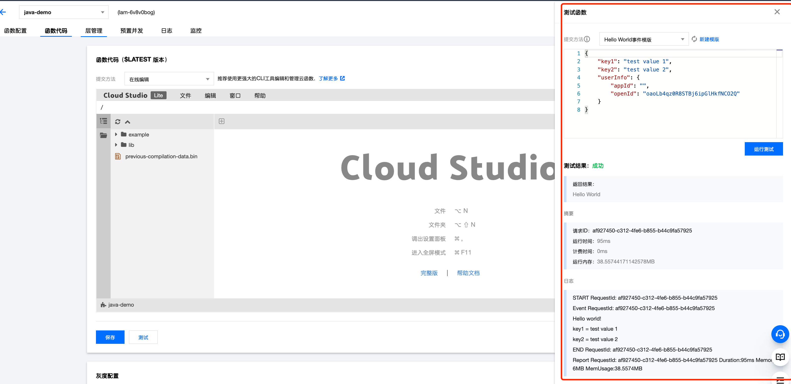

# 腾讯云 TCB SCF Java Demo

SCF Java Demo应用

## 构建项目

```bash
gradle build
```
查看构建产物：

```bash
tree build/distributions
```

需要部署的构建产物:

```
build/distributions
└── tcb-scf-java-demo.zip

0 directories, 1 file

```

## 部署方式：通过控制台直接部署

在控制台选择对应的 zip 文件上传：


在控制台进行测试：

